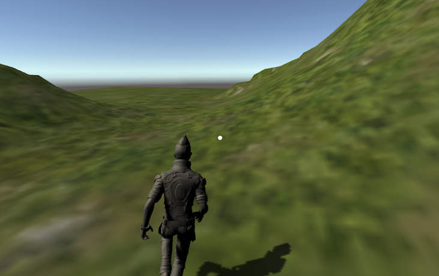

# GVR Tutorial Walking

With Google Virtual Reality here's 2 things we're going to achieve

- Move around a scene using a Google Cardboard VR kit in the First Person
- Create a Character and control its motion in a Chase view with the Cardboard Headset



## References and shoutouts

I'm a n00b to Unity and VR, and it took me about a week to figure this out. 
Most of what follows is based on these Tutorials and amalgmating pieces of each

- [Movement In Mobile VR: Autowalk by NurFACEGAMES](https://www.youtube.com/watch?v=JmgOeQ3Gric) - Character Control using CaharacterController
- [Movement In Mobile VR: Look Walk by NurFACEGAMES](https://www.youtube.com/watch?v=kBTn2pGwZUk) - Walking
- [Creating a Google Cardboard VR app in Unity 2017 by Rabidgremlin](https://www.youtube.com/watch?v=EAaoEe9ksyE) - Object interaction
- [Unity 3D - How to make your First Terrain (Beginner Tutorial) By DEYEmaginary](https://www.youtube.com/watch?v=WMBsdhELSwE)

## Setup

- Install Unity (I'm using 2018.1.5f1 Personal)
- Install [Google VR SDK](https://developers.google.com/vr/develop/unity/get-started-ios) (I'm using GoogleVRForUnity_1.130.1)
- Create Demo Project to verify it all works by following the instructions above.
- Additional setting
  - Under Resolution and Presentation, uncheck all except ***Landscape Left***, this fixes a bug in the GVR SDK

## Create the Scene

- Add the VR Assets as described in the link above

  - GvrEditorEmulator
  - GvrControllerMain
  - GvrEventSystem
  - GvrRecticlePointer (add to MainCamera)
  - GvrPointerPhysicsRayCaster (add to MainCamera)

- Create a Player
  - Create ```Menu>GameObject > Empty Object``` and rename to Player
  - On the Player Object add a CharacterComponent
  - Drag main camera to Player
  - Select Camera and right click on transform and click reset
  - Set Player Position to 1.8
    - we'll use each unit as a meter

- Create some interaction
  - Create ```GameObject > 3d Object > Cube```
  - Create a script that contains some [behaviour](./Assets/Scripts/VRLookWalk.cs)
  - Add component EventTrigger
    - allows the raycaster to detect it
  - Add a script

## Create Terrain and Skybox

- Create Terrain

  - Goto ```Assets >Import Package >Environment```
  - Goto Inspector > Click paint brush > Edit Textures

-- Create Skybox
  - Goto ```Window > Lighting > Settings```
  - Set the Skybox Material (i use Cope)

## Walking

###First Person View

Add the 3 scripts below to the 

- [VRLookWalk](./Assets/Scripts/VRLookWalk.cs)
- [VRAutoWalkLookDown](./Assets/Scripts/VRAutoWalkLookDown.cs)
- [VRLookWalkKeyboard](./Assets/Scripts/VRLookWalkKeyboard.cs)
- [VRLookWalkMagneticClick](./Assets/Scripts/VRLookWalkMagneticClick.cs)

### Third Person View

This is the one most people will be interested in - ** controlling a Character with head movement **

- Create a new Scene as above but stop at the **Create Player** stage
- Goto ```Assets >Import Package >Characters```
- Drag the new asset ```Standard Assets/Characters/ThirdPersonCharacter/Prefabs/ThirdPersonController``` to the scene (His name is Ethan apparently)
- Click the ThirdPersonController and uncheck the ```Third Person User Control (Script)```
  - We don't want to use this locomotion, we'll write out own and bind it to the ThirdPersonController
- Create an Empty Object and call it CameraCradle - drag it to the ThirdPersonController
- Drag the Main Camera to the CameraCradle
- In the Scene View, align the view to Ethan, then Menu>Game Object>Align With Viwe
  - This will match the Camera to the position you have the scene in, and will stick it there as it's a child object 
- Add this script to the MainCamera [ThirdPersonVRController](./Assets/Scripts/ThirdPersonVRController.cs) 
- Finally, there is a public property **Character** on the script above. Select the MainCamera in the Hierarchy View, and you will see it in the Inspector window. 
  then from the Hierarchy View drag the ThirdPersonController to the Character property in the Inspector Window - binding it to the script.
- Hit Play, and you should be controlling Ethan with slight head motion.
- Play around with the script and you can make the motion smoother.


